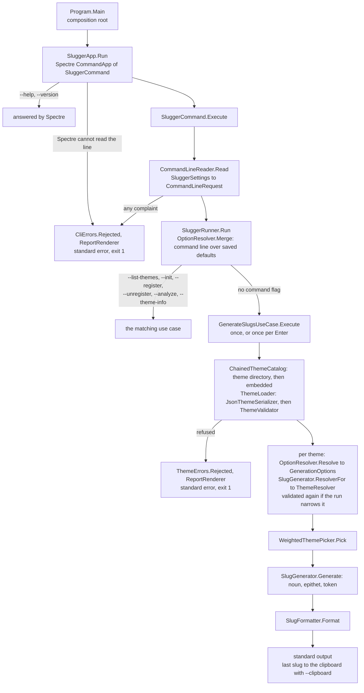

# Architecture

This page is a map of the code: what each assembly and namespace is for, how a command line becomes
a printed slug, where each concern lives and which decision records constrain which files. It
assumes you have read the [README](../README.md) and know what a slug and a theme are; the
vocabulary itself — slug, term, epithet, pool, segment — is defined in
[`ubiquitous-language.md`](ubiquitous-language.md). The newer types are named after it; the older
code still says "word" in places where the page would say "term".

For how to build, test and submit a change, see [`CONTRIBUTING.md`](../CONTRIBUTING.md); for the
files a common change touches, [`recipes.md`](recipes.md); for the public API as a library consumer
sees it, [`library.md`](library.md).

## Two assemblies, three layers

| Project | Ships as | Namespace | Visibility | Holds |
| --- | --- | --- | --- | --- |
| `src/Slugger` | the `Slugger` package | `Slugger` | public | `Themes`, the loading facade |
| | | `Slugger.Domain` (and sub-namespaces) | public | the theme model, resolution, drawing, rendering, validation, analysis |
| | | `Slugger.Application` | internal | the use cases, the precedence chain of options, the ports they need |
| | | `Slugger.Infrastructure` | internal | JSON reading, the embedded themes, the theme directory, the saved defaults |
| `src/Slugger.Cli` | the `Slugger.Cli` .NET tool, command `slugger` | `Slugger.Cli` | internal | the command line, the interactive loop, the composition root, rendering for the terminal, the clipboard adapter |

Three words from ports-and-adapters design recur on this page. A **port** is an interface the
application declares for something it needs from outside — reading themes, saving defaults, the
clipboard — and `src/Slugger/Application/Abstractions/` holds them. An **adapter** implements a
port with a real technology: the file system, System.Text.Json, TextCopy. The **composition root**
is the one place where the concrete classes are created and handed to each other, here
`Program.Main`; everything else receives what it needs through its constructor.

Dependencies point inwards only: `Domain` names nothing from `Application` or `Infrastructure`, and
`Application` names nothing from `Infrastructure`. The CLI and the three test projects reach the
internal layers through `InternalsVisibleTo`, declared in both `.csproj` files.

`Slugger.Domain` is what a library consumer is promised, together with the `Themes` facade. A type
there is public only when a consumer needs it — `ThemeAnalyzer` and `ICatalog`, for example, are
internal. Publishing a type later breaks nobody; unpublishing one breaks everyone who referenced it
([DEC0007](idr/DEC0007-surface-publique-reduite.md)).

### Why one assembly with three namespaces

The engine started as four assemblies, one per layer. Across assemblies, every layer has to be
public for the next one to use it, so four assemblies published the whole internal construction of
the engine. Merging them made `internal` possible, and the layers survive as namespaces: what
disappeared is a package graph a project this size has no use for, not the organisation of the code.

The cost is that the compiler no longer refuses a layering violation. Three test classes in
`tests/Slugger.ArchitectureTests/` replace it:

- `NamespaceDependencyTests` reads type signatures — base types, fields, properties, parameters,
  return types — and fails if a layer names a type from a layer further out. It also fails if
  `Application` or `Infrastructure` exposes a public type, and if the engine references an assembly
  outside its whitelist (below).
- `LayeringTests` reads the compiled assembly with ArchUnitNET, so it also sees what a method body
  reaches for. The two are kept apart on purpose: one says what a layer publishes, the other what it
  touches.
- `ClipboardDependencyTests` fails if `TextCopy` ever reaches the engine, and checks that the CLI is
  where it is referenced.

The same project holds `ValueObjectRulesTests`, `EntityRulesTests` and `DehydrationTests`, which
measure the rules for value objects and entities summarised in
[`CONTRIBUTING.md`](../CONTRIBUTING.md#value-objects-and-errors).

### The packaging boundary decides where a dependency may sit

The one split that is kept, between `Slugger` and `Slugger.Cli`, is a real packaging boundary. A
dependency `Slugger` takes on reaches everyone who references the package, as a line in its nuspec;
one `Slugger.Cli` takes on stops at the executable, because a .NET tool bundles what it needs.

So the engine's dependency list is a whitelist kept deliberately short: `FirstClassErrors`, for
`Outcome` and the error model, and `Value`, for the `ValueType<T>` base of the value objects.
`NamespaceDependencyTests.The_engine_depends_on_nothing_but_what_was_deliberately_taken_on` lists
them, which makes adding a third one a visible edit rather than an accident. `Spectre.Console` and
`TextCopy` belong to the CLI alone: a terminal and a clipboard have no meaning inside a slug engine.

The analyzers — `SonarAnalyzer.CSharp` and the `DiagnosticCatalog` packages — never reach a
consumer either, and two separate mechanisms make that true:

- A suppression written through `DiagnosticCatalog` uses compile-time constants, folded into the
  assembly before it is written, so nothing is left to reference at run time.
  `PackageWeightTests` measures that.
- `PrivateAssets="all"` keeps the analyzer packages out of the published dependency graph. No test
  reading the assembly can see that property: remove it and the nuspec grows a dependency while the
  compiled assembly does not change. The `AnalyzersStayPrivate` target in
  `Directory.Build.props` fails the build instead.

### Why the CLI assembly is not called `slugger`

A tool package ships the library beside the executable. An assembly called `slugger.dll` next to
`Slugger.dll` collides on a case-insensitive file system, so the CLI's assembly is `Slugger.Cli`,
and `ToolCommandName` in `Slugger.Cli.csproj` names the command `slugger`.

## From command line to printed slug



The same path in words, with the file each step lives in:

1. **`Program.Main`** (`src/Slugger.Cli/Program.cs`) is the composition root. It builds the ports by
   hand — `ThemeDirectory`, `XdgConfigStore`, `TextCopyClipboard`, three Spectre consoles — one on
   standard output for the help, laid out for 80 columns when it is redirected, and one on each
   stream for reports, which wrap no line when redirected — and the use cases, and hands them all
   to a `SluggerRunner`. There is no dependency-injection container;
   `PortRegistrar` only lets Spectre reach what `Main` already built.
2. **`SluggerApp.Run`** (`CommandLine/SluggerApp.cs`) runs a Spectre `CommandApp<SluggerCommand>`.
   It first rewrites the two spellings Spectre's tokenizer would refuse: a lone `-` after `--sep`
   or `--word-sep` is attached to its option, as in `--sep=-`, and `--word-sep=` becomes
   `--word-sep ""`. Spectre binds the arguments onto `SluggerSettings`, where every option is
   declared once — as text, or as a `FlagValue<string>` for a switch, which can be absent, on or
   explicitly off — and answers `--help` and `--version` itself
   ([DEC0019](idr/DEC0019-ligne-de-commande-declaree-et-rendue-par-spectre.md)). Parsing is left
   lenient: what Spectre cannot place lands in the remaining arguments instead of stopping the read.
   If Spectre refuses the line outright, `SluggerApp.Run` catches the exception and reports it like
   any other refusal.
3. **`CommandLineReader.Read`** (`CommandLine/CommandLineReader.cs`) converts every option and
   collects every complaint — unknown flags included — before refusing anything
   ([DEC0006](idr/DEC0006-rapport-groupe-des-refus.md)). It returns an
   `Outcome<CommandLineRequest>`: a `CliCommand`, the argument a command needs and a
   `SluggerOptions` in which null means "the command line said nothing about it". A refusal goes through
   `CliErrors.Rejected` and `ReportRenderer` to standard error, with exit code 1.
4. **`SluggerRunner.Run`** (`src/Slugger.Cli/SluggerRunner.cs`) reads the saved defaults through
   `IConfigStore.Read()` and prints its remarks — a file that is not JSON, an unknown key — as
   warnings. It merges the command line over the saved defaults with `OptionResolver.Merge`, warns
   about a theme directory that was named and does not exist and about any file in it whose name no
   `--theme` could select (`IThemeStore.Unselectable`), and switches on the `CliCommand`.
   Generating is the default. It loops — one round per Enter — unless `--oneshot` is set or
   standard input or standard output is not a terminal.
5. **`GenerateSlugsUseCase.Execute`** (`src/Slugger/Application/UseCases/`) asks the theme directory
   for a catalogue: a `ChainedThemeCatalog` over the `FileSystemThemeCatalog` and the
   `EmbeddedThemeCatalog`, so a file shadows a built-in theme of the same name. `--theme '*'` expands
   to every name the catalogue serves; no `--theme` means `slugger`.
6. **`ThemeLoader.Load`** (`src/Slugger/Infrastructure/Serialization/`) is the one path every theme
   takes, whichever catalogue it came from: `JsonThemeSerializer` reads the shape and normalises every
   word, then `ThemeValidator` runs the rules; their findings are reported together. The result is a
   `ThemeDocument`, or `ThemeErrors.Rejected` carrying every reason.
7. **Per theme**, `OptionResolver.Resolve` collapses the precedence chain — command line, then the
   drawn theme's own `defaults` when a single theme is drawn or `--mimic-style` asks for them, then
   the saved defaults, then the program's — into `GenerationOptions`
   ([DEC0004](idr/DEC0004-chaine-de-priorite-unique.md)). `SlugGenerator.ResolverFor` builds the
   `ThemeResolver` for that run, narrowed by `--max-length` or `--max-segment-words` where they are
   set. A narrowed theme, or one drawn in a segment mode other than its own, is validated again,
   because it is not the theme that loaded
   ([DEC0018](idr/DEC0018-longueur-maximale-tenue-en-retirant-des-mots.md),
   [DEC0016](idr/DEC0016-planchers-alignes-sur-le-mode-de-segment.md)). All of this happens once
   per batch, never once per slug.
8. **For each slug**, `WeightedThemePicker.Pick` chooses a theme in proportion to its noun count,
   `SlugGenerator.Generate` draws a noun, the epithet the segment mode asks for and the token, and
   `SlugFormatter.Format` renders them into a string. One `DefaultRandomSource`, seeded from
   `--seed` when there is one, is created by the runner before the first round and handed to
   `GenerateSlugsUseCase.Execute` on every round, so a seeded session replays every slug, Enter
   after Enter.
9. The runner prints each slug on standard output. With `--clipboard`, the use case copies the last
   one through `IClipboard`. A copy that fails does not throw: its reason comes back in
   `GeneratedSlugs` beside the slugs, and the runner prints it as a warning on standard error,
   after them.

The other commands — `--list-themes`, `--init`, `--register`, `--unregister`, `--analyze` and
`--theme-info` — each have their own use case in `src/Slugger/Application/UseCases/` and their own
method in `SluggerRunner`.

## Where things live

| Concern | Files |
| --- | --- |
| Every option, its `--help` text | `src/Slugger.Cli/CommandLine/SluggerSettings.cs` |
| Converting and refusing the command line | `src/Slugger.Cli/CommandLine/CommandLineReader.cs`, `CliErrors.cs`, `CliErrorCodes.cs`, `CliCommand.cs` |
| Spectre set-up, the examples in `--help` | `src/Slugger.Cli/CommandLine/SluggerApp.cs`, `SluggerCommand.cs`, `PortRegistrar.cs` |
| Composition root | `src/Slugger.Cli/Program.cs` |
| Dispatch, interactive loop, what the terminal prints | `src/Slugger.Cli/SluggerRunner.cs`, `IConsole.cs`, `SystemConsole.cs` |
| Refusal reports, the `--analyze` report | `src/Slugger.Cli/Rendering/` |
| Clipboard | `src/Slugger/Application/Abstractions/IClipboard.cs` (port), `src/Slugger.Cli/Adapters/TextCopyClipboard.cs` (adapter) |
| Precedence chain of options | `src/Slugger/Application/Options/` |
| Use cases | `src/Slugger/Application/UseCases/` |
| Ports | `src/Slugger/Application/Abstractions/` |
| Reading a theme file | `src/Slugger/Infrastructure/Serialization/` |
| Finding a theme by name | `src/Slugger/Infrastructure/ThemeCatalogs/` |
| Built-in themes | `src/Slugger/Infrastructure/Resources/*.json`, minified and embedded by `src/Slugger/Slugger.csproj` |
| Saved defaults (`--init`) | `src/Slugger/Infrastructure/Configuration/XdgConfigStore.cs` |
| A theme as read from its file | `src/Slugger/Domain/ThemeDocument.cs`, `NounEntry.cs`, `ThemeDefaults.cs`, `ThemeMetadata.cs`, `MaxLength.cs` |
| Normalising a word at load | `src/Slugger/Domain/Normalization/WordNormalizer.cs` |
| Pools: categories, `common`, `except`, `incompatible`, the narrowing of a run | `src/Slugger/Domain/Resolution/ThemeResolver.cs` |
| Drawing from several themes | `src/Slugger/Domain/Resolution/WeightedThemePicker.cs` |
| Drawing a slug | `src/Slugger/Domain/Generation/SlugGenerator.cs`, `src/Slugger/Domain/SegmentMode.cs`, `SegmentModes.cs` |
| Rendering a slug | `src/Slugger/Domain/Generation/SlugFormatter.cs` |
| Length budget | `src/Slugger/Domain/Generation/SlugBudget.cs` |
| Options handed to the engine | `src/Slugger/Domain/GenerationOptions.cs` |
| Randomness | `src/Slugger/Domain/IRandomSource.cs`, `DefaultRandomSource.cs` |
| Validation rules and floors | `src/Slugger/Domain/Validation/ThemeValidator.cs`, `ThemeCombinatorics.cs`, `ThemeErrors.cs` |
| Measuring a theme | `src/Slugger/Domain/Analysis/` |
| Value objects of the new model | `src/Slugger/Domain/` — `Word`, `Term`, `Category`, `Chance`, `Token`…, with an `Error` and an `Exception` beside each one that can refuse a value |
| Public loading facade | `src/Slugger/Themes.cs` |
| Analyzer suppression reasons | `src/Slugger/SuppressionJustifications.cs` |
| Themes shipped as files | `themes/` |
| Pinned output of every theme | `tests/Slugger.Cli.UnitTests/GoldenMaster/` |
| Rules about the shape of the code | `tests/Slugger.ArchitectureTests/` |

## Two theme models, side by side

A refactoring is in progress, and it leaves two models of a theme in the code. Read
[`refactoring-in-progress.md`](refactoring-in-progress.md) before you change either.

| | Used by the engine today | Built, not yet wired in |
| --- | --- | --- |
| The theme | `ThemeDocument` (public) — the shape of the file, words as strings | `Theme` (public, `[Entity]`) — nothing outside the assembly can build one, and nothing inside builds one yet |
| Where themes come from | `IThemeCatalog` (internal), implemented by the embedded, file-system and chained catalogues | `ICatalog` (internal, `[Repository]`) — no implementation yet |
| The words | `string`, everywhere: `ThemeResolver`, `SlugGenerator`, `ThemeValidator` | `Word`, `Term`, `Noun`, `Adjective`, `Participle`, `Epithet`, `Slug`… pinned by their own tests |

Every `Themes.Load*` returns a `ThemeDocument`, every `SlugGenerator.Generate` takes one and every
catalogue hands one back. **A fix to how slugs are drawn, validated or rendered belongs in the
`ThemeDocument` path**: a change made only to `Theme` or `ICatalog` changes nothing a user can see.
The only bridge built so far is `SlugFormatter.Format(Slug, GenerationOptions)`, which renders a
`Slug` of the new model; its tests call it, and the engine does not yet.

## How a refusal travels

Loading a theme and reading a command line never throw to refuse. Each reason for a refusal is a
`DomainError` from FirstClassErrors, and the refusal travels in an `Outcome<T>`:

- Each situation has a factory — `ThemeErrors.PoolTooSmall(...)`, `CliErrors.NotAWholeNumber(...)` —
  which writes the message once.
- `ThemeErrors.Rejected` and `CliErrors.Rejected` wrap every reason as inner errors, so one run
  reports all of them ([DEC0006](idr/DEC0006-rapport-groupe-des-refus.md)).
- `ReportRenderer` in the CLI prints each reason's diagnostic message, grouped by error code: it
  names three of each kind and counts the rest. `--register` and a load at run time call the same
  factories, so they print the same words.
- The throwing shapes — `Themes.LoadEmbedded` and the like — raise FirstClassErrors'
  `DomainException`, whose `Error` holds the same report.

Two styles of error type coexist in the code; [`CONTRIBUTING.md`](../CONTRIBUTING.md#value-objects-and-errors)
says which one new code uses.

## Decisions by code area

The decision records in [`idr/`](idr/README.md) say why the code is the way it is, and what each
decision rules out. They are in French. The table that maps each area of the code to the decisions
that constrain it is in the [decision index](idr/README.md#decisions-by-code-area). To find the
decisions a file names, run:

```bash
grep -rn DEC00 src/Slugger/Domain/Resolution/ThemeResolver.cs
```
